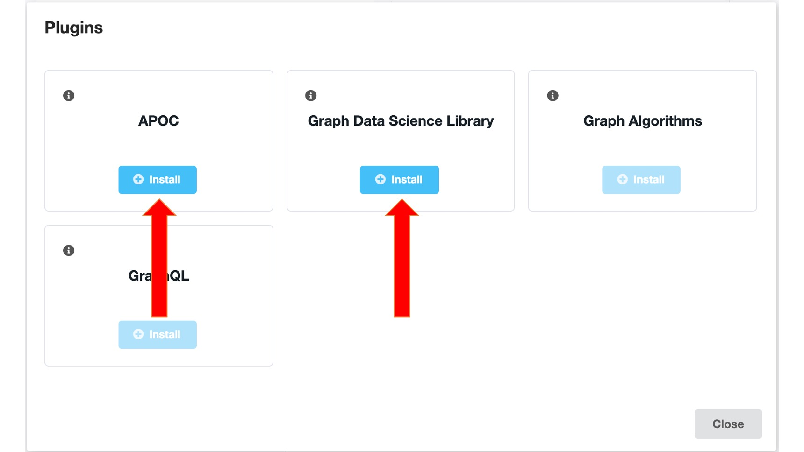

= networkx-neo4j

This library provides NetworkX API for https://github.com/neo4j/graph-data-science/[Neo4j Graph Data Science^].
You should be able to use it as you would NetworkX but algorithms will run against Neo4j.

== Dependencies

- ≥ Neo4j 4.x
- Graph Data Science Library Plugin
- APOC Plugin
- ≥ Python 3.6
- ≥ neo4j-driver 4.x

== Installation

You can install the library by running the following command:

[source, bash]
----
pip install networkx-neo4j
----

You'll also need to install APOC and the Graph Algorithms library.

== Usage

Here's how you use it.

First let's import our libraries and create an instance of the Neo4j driver:

[source, python]
----
>>> from neo4j import GraphDatabase
>>> import nxneo4j as nx

>>> driver = GraphDatabase.driver(uri="bolt://localhost",auth=("neo4j","your_password"))
----
For undirected Graphs:
[source, python]
----
>>> G = nx.Graph(driver)
----
For directed Graphs:
[source, python]
----
>>> G = nx.DiGraph(driver)
----

The available functions in `nxneo4j` are:
[source, python]
----
# ADD ONE NODE
G.add_node(node)
node: str, int
>>> G.add_node(1)

# ADD MULTIPLE NODES
G.add_nodes_from(value)
values: list
>>> G.add_nodes_from([1, 2, 3, 4])

# ADD ONE EDGE
G.add_edge(node1,node2)
node1: str, int
node2: str, int
>>> G.add_edge(1,2)

#ADD MULTIPLE EDGES
G.add_edges_from(values)
values: list of tuples
>>> G.add_edges_from([(1, 2),(2, 3),(3, 4)])
----

The available algoritms in `nxneo4j` are:
[source, python]
----
>>> nx.betweenness_centrality(G)
{3: 4.0, 4: 3.0, 1: 0.0, 2: 0.0, 5: 0.0}

>>> nx.closeness_centrality(G)
{3: 0.8, 4: 0.6666666666666666, 1: 0.5714285714285714, 2: 0.5714285714285714, 5: 0.4444444444444444}

>>> nx.pagerank(G)
{3: 1.4170146573314513, 4: 1.0629939728840803, 1: 0.9591085771210682, 2: 0.9591085771210682, 5: 0.6017724112363687}

>>> nx.triangles(G)
{1: 1, 2: 1, 3: 1, 4: 0, 5: 0}

>>> nx.clustering(G)
{1: 1.0, 2: 1.0, 3: 0.3333333333333333, 4: 0.0, 5: 0.0}

>>> list(nx.community.label_propagation_communities(G))
[{1, 2, 3, 4, 5}]

>>> nx.shortest_path(G, source=1, target=5)
[1, 3, 4, 5]

----

== Credits
Yusuf Baktir
Mark Needham
David Jablonski
